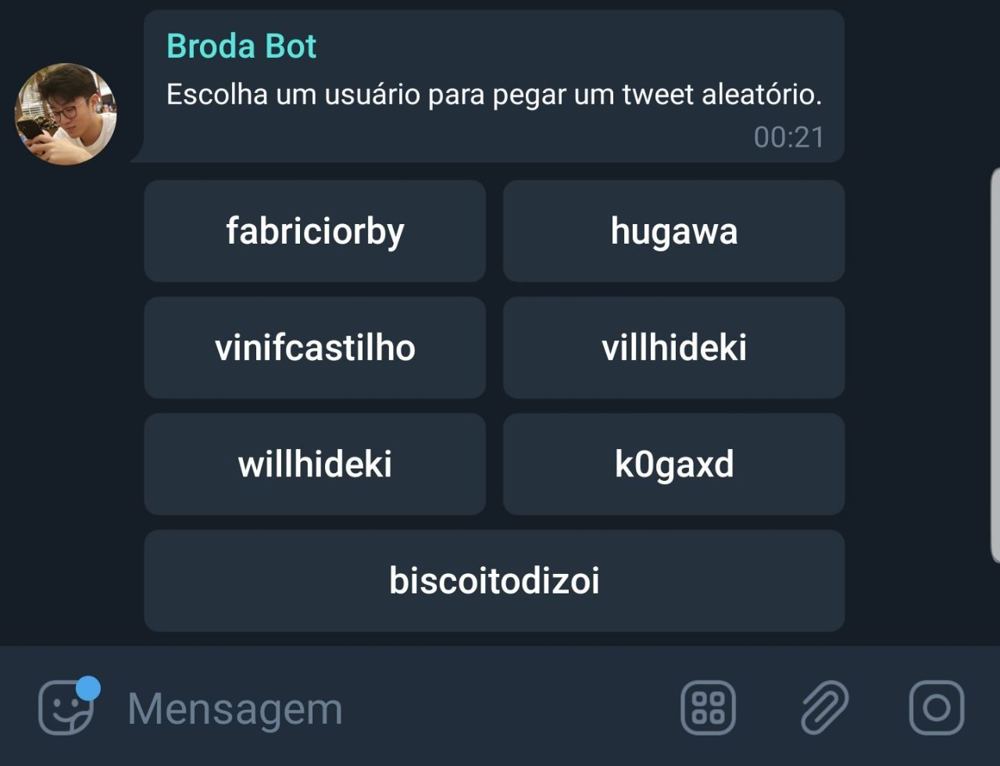
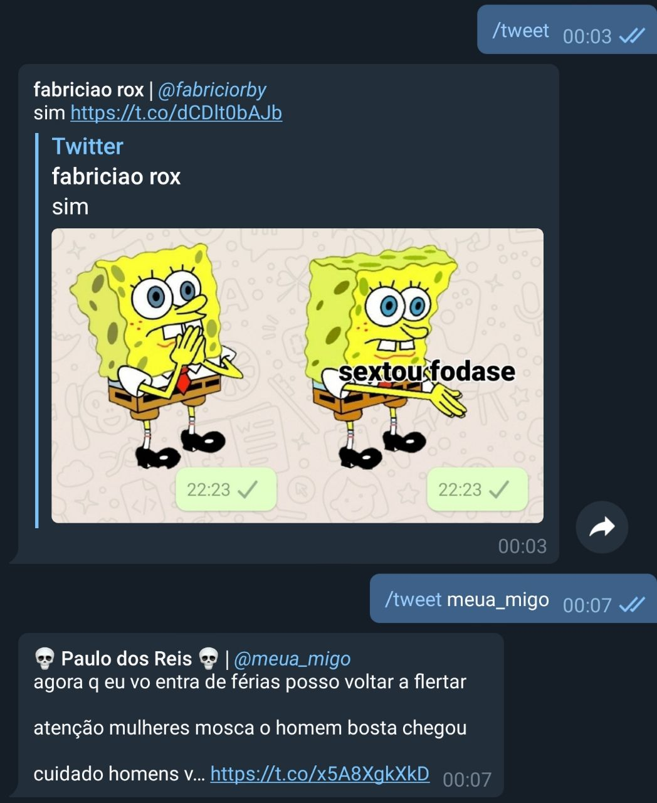

# twitter-bot-telegram

Fiz esse bot com intuito de brincar com os amigos num chat de Telegram, mas como ficou bacana, resolvi tirar a parte das piadas internas e disponibilizar a parte em que me comunico com a API do Twitter.

Caso você nunca tenha mexido com API do Twitter ou Bot do Telegram... Recomendo que dê uma olhada sobre a parte de tokens de acesso.

Eu peguei a biblioteca do Telegram por aqui: https://github.com/yagop/node-telegram-bot-api

Pra conseguir o token do Twitter você vai precisar se cadastrar aqui: https://developer.twitter.com/en.html

## Instalação

Antes de tudo, é necessário criar um arquivo .env com os tokens direitinho.

```
TOKEN='TOKEN DO SEU BOT AQUI'
TWITTER_SECRET_API_KEY='SUA KEY AQUI'
TWITTER_API_KEY='SUA KEY AQUI'
TWITTER_ACCESS_TOKEN_KEY='SEU TOKEN AQUI'
TWITTER_ACCESS_TOKEN_SECRET='SEU TOKEN AQUI'
```

Depois disso é só mandar um `npm install` e então `npm start`.

```log
fabri@DESKTOP-S0FEVEB MINGW64 ~/Desktop/projects/personal/twitter-bot-telegram (master)
$ npm start

> broda-bot-telegram@1.0.0 start C:\Users\fabri\Desktop\projects\personal\twitter-bot-telegram
> node index

node-telegram-bot-api deprecated Automatic enabling of cancellation of promises is deprecated.      
In the future, you will have to enable it yourself.
See https://github.com/yagop/node-telegram-bot-api/issues/319. internal\modules\cjs\loader.js:688:30

Warning: Push method does not return `this` anymore. Unexpected behaviour may happen. has been deprecated.
Iniciando o teclado, bug no primeiro push. Sim, isso é uma gambiarra.
Web server started at http://0.0.0.0:54860
385156462 'fabriciorby' 'me segura pra eu nao compra akira inteiro https://t.co/rJ6o4j0GfV'
385156462 'meua_migo' 'linda a homofobia dele https://t.co/aoORS5965k'
```

Pra alterar os usuários do teclado, é necessário adicionar os ids. Pra isso é só editar o utils.twitterUsers e pegar os ids, por exemplo, nesse site http://gettwitterid.com/

## Prints


